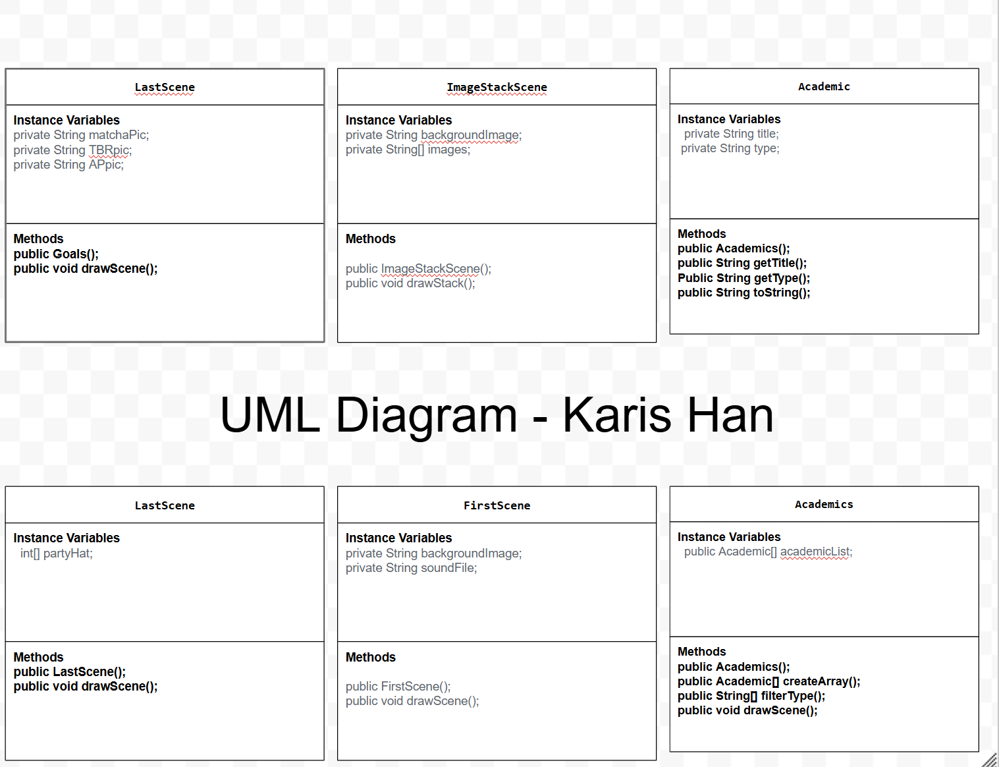

# New-Me-New-Scene-Project

# Project: New Scene, New Me

## Introduction

Software engineers develop programs to create visual and audio experiences using object-oriented programming. As we begin 2026, your goal is to create an animation program that reflects on your experiences from 2025 and visualizes your goals and aspirations for the year ahead using the Theater and Scene API.

## Requirements

Use your knowledge of object-oriented programming, one-dimensional (1D) arrays, algorithms, and the Theater/Scene API to create your animation program:
- **Write Scene subclasses** – Create two Scene subclasses: one to visualize your 2025 recap (LastYear) and another to project your 2026 goals (ThisYear). Each class must include both a no-argument constructor and a parameterized constructor.
- **Use private instance variables** – Implement proper encapsulation by declaring instance variables as private in your Scene subclasses.
- **Create 1D arrays** – Create at least two 1D arrays to store data for your scenes. One array must be created using an initializer list, and one array must be populated by reading from a text file using the FileReader class.
- **Write a method** – Write a method that finds or manipulates the elements in a 1D array to provide the information your user needs.
- **Access and modify array elements** – Use algorithms to traverse, access, and/or modify elements in your 1D arrays to display personalized content in your scenes.
- **Use logic and iteration** – Incorporate selection statements (if/if-else) and loops (while, for, or enhanced for) to control the flow and display of content in your scenes.
Incorporate variety of media – Use at least four different types of Scene API methods across both scenes (examples: drawImage(), drawText(), drawRectangle(), drawEllipse(), playSound(), setTextStyle(), setFillColor(), etc.).
- **Create a UML diagram** – Design a UML class diagram showing your Scene subclasses with their instance variables, constructors, and methods before you begin coding.
- **Document your code** – Use multi-line comments to explain the purpose of each method (including preconditions and postconditions) and single-line comments to explain code segments.

## UML Diagram 

 

## Description of 2025 recap
My recap showed two different screens. The first was a list of academic-related achievements I accomplished during 2025. I sorted all of them by type (specifically only competitions) because I am most proud of winning those. All 3 of the ones shown are from janggu performances (korean traditional drum). They took a lot of time and practice to master, and so I wanted to display those achievements. The second screen I showcased was the photo dump of my friends and family. Since they are among the most important people in my life, I wanted to feature them and recognize how much they have helped/motivated me to grow this past year.

## Description of 2026 goals
Some goals that I included in my 2026 scene including making matcha, finishing my TBR, and getting 5s on my AP tests. For Christmas, my parents had gotten me all of the equipment necessary to make a matcha latte. Since I love drinking matcha, I was ecstatic and began to make different ones. However, in order to get the foam on the top, I need to practice the w-motion in order to make it more creamy. Therefore, my 2026 goal is to become better at making matchas so that I can create high-quality ones. Next, my TBR (to be read) is a long list of books that are sitting on my bookshelf, collecting dust. So, this year, I want to finish reading them and stop buying new books to save money. Lastly, I want to get all 5s on my AP test this year since I am trying to juggle 4 different APs.

## Scene API Usage
I used several Scene API methods to create an engaging and fluid animation that combined images, shapes, text, and sound. The drawImage() method allowed me to display background images and photos on the photo stack. In addition, I used the rotation argument to create the image stack effect. I also utilized the drawText(), setTextStyle(), setTextHeight(), and setTextColor() to clearly display titles, achievements, and goals across the different scenes. Methods like drawRectangle(), drawEllipse(), and drawShape() were used to add custom visuals/shapes to the scene. To make my animation more engaging, I also incorporated audio using the playSound() and controlled pacing with the pause() method. Lastly, I used the clear() method to smoothly transition between scenes and allow only the appropriate segments to be displayed on each screen. Using these methods, I was able to make my animation visually organized, dynamic, and easy to read.